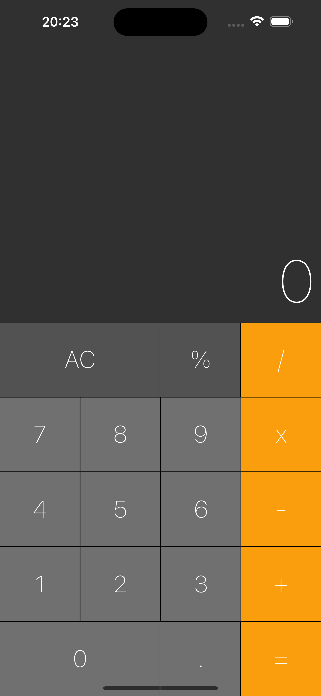

# Calculador

Esta é uma cópia do aplicativo Calculadora do iPhone, feito em flutter

## Layout

 

### Dependências
- ``auto_size_text: ^3.0.0``

### Tecnologias utilizadas
- ``VSCode``
- ``Dart``
- ``Flutter``
- ``XCode = Emulador de IOs``
- ``Android Studio = Emulador Android``
- ``iPad = Emulador iPadOS``
